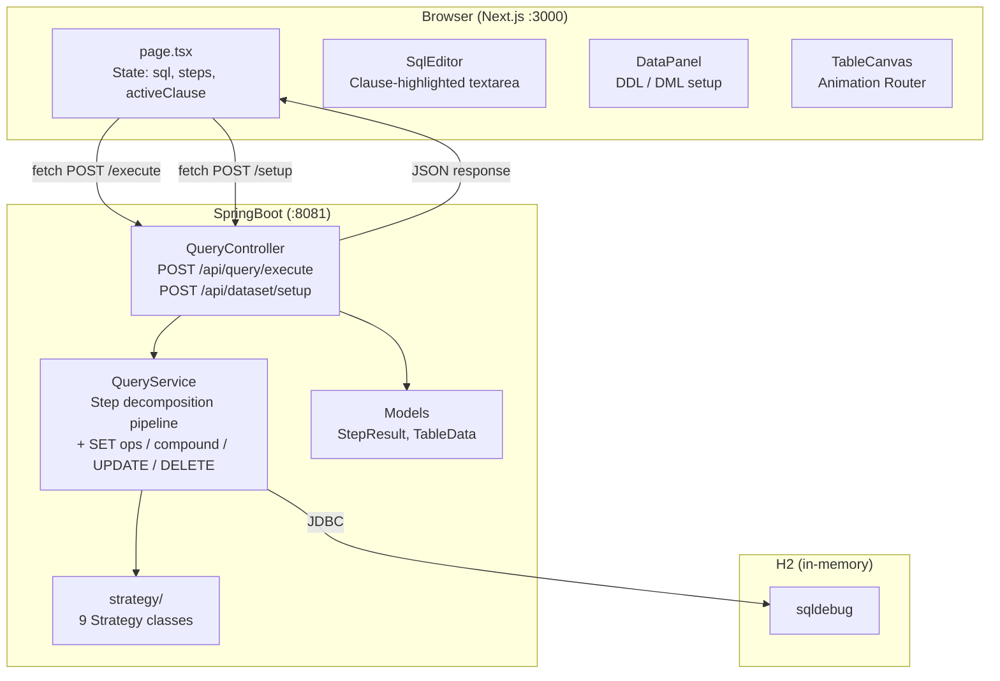
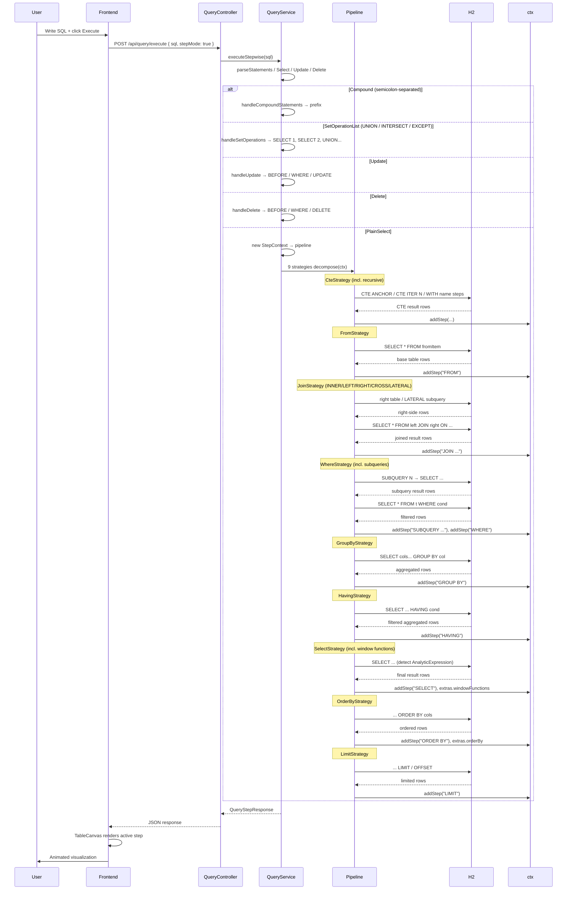

# Seeql — SQL Visual Debugger

Step-by-step SQL execution visualizer. Parses a SQL query, decomposes it into clause-level steps (FROM → WHERE → GROUP BY → HAVING → SELECT → DISTINCT → JOIN → ORDER BY → LIMIT), executes each against H2, and animates the transformations in the browser.

Supports CTEs (including recursive), subqueries in WHERE, set operations (UNION/INTERSECT/EXCEPT), multiple FROM items, LATERAL joins, window function annotations, compound statements, and UPDATE/DELETE decomposition.

---

## Architecture

### System Context



### Backend — Strategy Pattern


### Pipeline Execution



### Frontend Component Tree

```mermaid
graph TB
    subgraph Layout["app/page.tsx"]
        PS["Problem Selector<br/>12 LeetCode problems"]
        SE["SqlEditor<br/>- Textarea<br/>- Clause-highlighting overlay"]
        DP["DataPanel<br/>- DDL tab<br/>- DML tab"]
        TC["TableCanvas<br/>- StepTimeline breadcrumb<br/>- Play/step controls"]
    end

    subgraph Animations["components/table-canvas/"]
        ST["StepTimeline<br/>Step progression bar"]
        GA["GroupAnimation<br/>5-phase bucket flying<br/>Rows → Assign → Buckets → Collapse → Result"]
        CA["CteAnimation<br/>4-phase partition<br/>Input → Partition → Compute → Result"]
        DA["DistinctAnimation<br/>4-phase dedup<br/>Rows → Mark → Remove → Result"]
        JA["JoinAnimation<br/>4-phase join<br/>Left → Right → Matching → Result<br/>(INNER/LEFT/RIGHT/CROSS/LATERAL)"]
        WA["WhereAnimation<br/>4-phase filter<br/>Evaluate → PASS/FAIL buckets → Result"]
        SA["SelectAnimation<br/>4-phase projection<br/>Columns → KEPT/DROPPED buckets → Result"]
        OA["OrderByAnimation<br/>4-phase sort<br/>Unsorted → Sorting → Sorted ranks → Result"]
        LA["LimitAnimation<br/>4-phase cutoff<br/>All → Cutoff → Remove → Result"]
        TA["TransitionAnimation<br/>3-phase generic<br/>Before → Appearing → Result"]
    end

    subgraph Shared["lib/"]
        T["types.ts<br/>StepResult, TableData"]
        A["api.ts<br/>fetch wrappers"]
        AU["animation-utils.ts<br/>rowKey, GROUP_COLORS, CLAUSE_BADGE_COLORS"]
        CH["clause-highlighter.ts<br/>findClauses, findClauseSpans"]
        PU["use-phase-stepper.ts<br/>prev/next/play/toggle hook"]
    end

    TC --> ST
    TC --> GA
    TC --> CA
    TC --> DA
    TC --> JA
    TC --> WA
    TC --> SA
    TC --> OA
    TC --> LA
    TC --> TA
    TC --> T
    TC --> AU
    GA --> AU
    GA --> PU
    CA --> AU
    CA --> PU
    DA --> AU
    DA --> PU
    JA --> AU
    JA --> PU
    WA --> AU
    WA --> PU
    SA --> AU
    SA --> PU
    OA --> AU
    OA --> PU
    LA --> AU
    LA --> PU
    TA --> AU
    TA --> PU
    SE --> CH
```



### Animation Dispatch Logic

```mermaid
flowchart LR
    A["Step from API"] --> B{"clause?"}
    B -->|"GROUP BY + has groupColumns"| GA["GroupAnimation<br/>5 phases"]
    B -->|"starts WITH " or "starts CTE "| CA["CteAnimation<br/>4 phases"]
    B -->|"DISTINCT"| DA["DistinctAnimation<br/>4 phases"]
    B -->|"includes JOIN "| JA["JoinAnimation<br/>4 phases"]
    B -->|"WHERE / HAVING / CTE.WHERE"| WA["WhereAnimation<br/>4 phases<br/>(pass/fail buckets)"]
    B -->|"SELECT / CTE.BODY"| SA["SelectAnimation<br/>4 phases<br/>(keep/drop column buckets)"]
    B -->|"ORDER BY"| OA["OrderByAnimation<br/>4 phases<br/>(staggered sort)"]
    B -->|"LIMIT"| LA["LimitAnimation<br/>4 phases<br/>(cutoff line)"]
    B -->|"else"| TA["TransitionAnimation<br/>3 phases<br/>(fallback for 10+ types)"]
```

---

## REST API

| Endpoint | Method | Body | Returns |
|----------|--------|------|---------|
| `/api/query/execute` | POST | `{ sql, stepMode }` | `{ steps: StepResult[], finalResult: TableData }` |
| `/api/dataset/setup` | POST | `{ sql }` | `{ status: "ok" }` |

### StepResult (SELECT query)

```json
{
  "clause": "JOIN busy b",
  "sql": "WITH busy AS (...) SELECT * FROM Stadium s JOIN busy b ON s.id = b.id",
  "data": { "columns": ["ID","PEOPLE","GRP"], "rows": [...], "totalRows": 6 },
  "groupColumns": ["GRP"],
  "extras": {
    "rightTableData": { "columns": [...], "rows": [...], "totalRows": 6 },
    "onCondition": "s.id = b.id",
    "rightTable": "busy b",
    "leftTable": "Stadium s",
    "joinType": "INNER"
  }
}
```

### StepResult (UPDATE)

```json
{
  "clause": "UPDATE",
  "sql": "UPDATE products SET price = 15 WHERE id = 1",
  "data": { "columns": ["ID","NAME","PRICE"], "rows": [...], "totalRows": 3 },
  "extras": {
    "setAssignments": "price = 15",
    "beforeData": { "columns": [...], "rows": [...], "totalRows": 3 }
  }
}
```

### StepResult (window function)

```json
{
  "clause": "SELECT",
  "sql": "SELECT id, ROW_NUMBER() OVER (ORDER BY id) AS rn FROM a",
  "data": { "columns": ["ID","RN"], "rows": [...], "totalRows": 3 },
  "extras": {
    "windowFunctions": [{
      "name": "ROW_NUMBER",
      "expression": null,
      "partitionBy": null,
      "orderBy": "[id]",
      "windowFrame": null
    }]
  }
}
```

### StepResult (compound statement)

```json
{
  "clause": "#1 SELECT",
  "sql": "SELECT * FROM a WHERE id = 1",
  "data": { "columns": ["ID","NAME"], "rows": [...], "totalRows": 1 }
}
```

---

## Project Structure

```
Seeql/
├── Backend/sql-visualizer-backend/
│   ├── pom.xml
│   └── src/main/java/com/sqlvisualizer/backend/
│       ├── SqlVisualizerBackendApplication.java
│       ├── config/CorsConfig.java
│       ├── controller/QueryController.java
│       ├── model/
│       │   ├── QueryRequest.java
│       │   ├── TableData.java
│       │   └── QueryStepResponse.java
│       ├── service/
│       │   └── QueryService.java           # pipeline + SET/compound/UPDATE/DELETE
│       └── strategy/
│           ├── StepStrategy.java            # interface
│           ├── StepContext.java             # shared context
│           ├── CteStrategy.java             # incl. recursive CTE iteration
│           ├── FromStrategy.java
│           ├── JoinStrategy.java            # INNER/LEFT/RIGHT/CROSS/LATERAL
│           ├── WhereStrategy.java           # subquery detection
│           ├── GroupByStrategy.java
│           ├── HavingStrategy.java
│           ├── SelectStrategy.java          # window function annotation
│           ├── OrderByStrategy.java
│           └── LimitStrategy.java
│
├── Frontend/fitkit-web/
│   ├── app/
│   │   ├── layout.tsx
│   │   └── page.tsx
│   ├── components/
│   │   ├── sql-editor/SqlEditor.tsx
│   │   ├── data-panel/DataPanel.tsx
│   │   ├── table-canvas/
│   │   │   ├── TableCanvas.tsx             # animation router
│   │   │   ├── StepTimeline.tsx
│   │   │   ├── GroupAnimation.tsx          # 5-phase GROUP BY
│   │   │   ├── CteAnimation.tsx            # 4-phase WITH / window
│   │   │   ├── DistinctAnimation.tsx       # 4-phase DISTINCT
│   │   │   ├── JoinAnimation.tsx           # 4-phase JOIN
│   │   │   ├── WhereAnimation.tsx          # 4-phase WHERE/HAVING
│   │   │   ├── SelectAnimation.tsx         # 4-phase SELECT projection
│   │   │   ├── OrderByAnimation.tsx        # 4-phase ORDER BY sort
│   │   │   ├── LimitAnimation.tsx          # 4-phase LIMIT cutoff
│   │   │   └── TransitionAnimation.tsx     # 3-phase fallback
│   │   └── ui/                             # shadcn components
│   ├── hooks/
│   │   └── use-phase-stepper.ts
│   └── lib/
│       ├── api.ts
│       ├── types.ts
│       ├── animation-utils.ts
│       ├── clause-highlighter.ts
│       ├── problems.ts                     # 12 LeetCode problems
│       └── utils.ts
│
└── README.md
```

---

## Stack

| Layer | Technology |
|-------|-----------|
| Frontend | Next.js 16, TypeScript, Framer Motion, shadcn/Radix UI |
| Backend | SpringBoot 4.0.6, Java 21, JSQLParser 5.3 |
| Database | H2 (in-memory, port 8081) |

---

## Key Design Decisions

- **Single request/response**: Backend returns ALL step results in one response. Frontend owns animation timing and pacing.
- **Strategy pattern**: Each SQL clause (FROM, WHERE, GROUP BY, HAVING, SELECT, DISTINCT, JOIN, ORDER BY, LIMIT, CTE) is a separate strategy class implementing `StepStrategy`. Adding a new clause type = adding one new class → no existing code changes.
- **Progressive JOIN building**: The Nth JOIN step includes all N joins in its FROM clause, so CTE + multi-JOIN queries work correctly.
- **Implicit comma joins (`FROM a, b`)**: Parsed as `isSimple()` cross joins by JSQLParser. JoinStrategy appends `, rightItem` (not ` join.toString()` which would produce `a b` = `a AS b`).
- **LATERAL joins**: Detected via `instanceof LateralSubSelect`. Inner subquery extracted and executed independently (if not correlated). Labeled `LATERAL JOIN`.
- **Subqueries in WHERE**: `ParenthesedSelect` nodes detected via `ExpressionVisitorAdapter` overriding `visit(Select)` (not `visit(ParenthesedSelect)` — JSQLParser 5.3 dispatches to `visit(Select)` for all `Select` subtypes).
- **Recursive CTE**: Detected via `WithItem.isRecursive()`. Decomposed into `CTE ANCHOR` / `CTE ITER N` / final `WITH name` steps. H2 2.x does not support `WITH RECURSIVE`, so iteration relies on executing the full CTE at each level.
- **Window functions**: `AnalyticExpression` detected in SELECT items. `name`, `partitionBy`, `orderBy`, `windowFrame` (type/offset/range), `windowDefinition` added to step extras.
- **UPDATE/DELETE**: Non-SELECT statements decomposed inline in `QueryService`. Show `BEFORE` (full table), `WHERE` (filtered rows), then `UPDATE`/`DELETE` (result) with `beforeData` and `setAssignments` extras.
- **Compound statements**: Auto-split via `CCJSqlParserUtil.parseStatements()`. Each statement executed independently, step clauses prefixed with `#1`, `#2`, etc.
- **Set operations**: `SetOperationList` (UNION/INTERSECT/EXCEPT) — each `SELECT` executed independently, then combined in final step.
- **CTE-body exclusion**: Clause-highlighter skips standard SQL keywords inside CTE body parentheses — only main-query clauses are highlighted.
- **Dedicated step animations**: Every clause type gets a multi-phase animation — GroupAnimation (5-phase bucket flying), WhereAnimation (4-phase pass/fail buckets), SelectAnimation (4-phase column keep/drop buckets), OrderByAnimation (4-phase staggered sort), LimitAnimation (4-phase cutoff line), CteAnimation (4-phase partition), DistinctAnimation (4-phase dedup), JoinAnimation (4-phase matching bridge), and TransitionAnimation (3-phase generic fallback for FROM/BEFORE/INSERT/UPDATE/DELETE/VALUES/SUBQUERY/etc.).
- **Shared animation primitives**: `rowKey`, `GROUP_COLORS`, `CLAUSE_BADGE_COLORS`, `getGroupColor`, `isGroupStep` are shared across all animation components.
- **usePhaseStepper**: Custom hook provides prev/next/play/toggle with inline phaseIdx clamp (no crashes when phases array length changes).

---

## Suggested Optimizations

### Performance & UX

| Area | Suggestion | Impact |
|------|-----------|--------|
| **Animation pacing** | Scale row stagger inversely with row count: `Math.min(0.04, 1.5 / rowCount)`. Current fixed 0.02-0.06s per row means 30s+ animation for 500 rows. | High — large tables become unusable |
| **Transition descriptions** | Add text overlays ("Loading FROM...", "Applying CTE anchor...") to the generic 3-phase fallback so users understand what invisible steps are doing. | Medium — improves learnability |
| **Speed slider** | Add a 0.5× / 1× / 2× / 5× multiplier on `phaseInterval` so users control pacing at runtime. | Low — nice-to-have |

### Code Quality

| Area | Suggestion | Impact |
|------|-----------|--------|
| **`getAnimationType()` utility** | Extract the 50-line inline switch in `TableCanvas.renderStepContent()` to a standalone function in `animation-utils.ts`. Makes testing possible and reduces component noise. | Medium — maintainability |
| **`AnimatedTable.tsx`** | File is no longer imported anywhere. Can be deleted to remove dead code. | Low — cleanup |
| **CTE SQL reconstruction** | `CteStrategy.decomposeCTEBody()` builds step SQL via string concatenation which can miss edge cases. Use `StatementDeParser.toString()` for robust SQL generation. | Medium — correctness |

### Architecture

| Area | Suggestion | Impact |
|------|-----------|--------|
| **Parallel subqueries** | WHERE-clause subqueries are independent. Use `CompletableFuture.allOf()` to execute them concurrently. | Medium — speedup on complex queries |
| **Backend error fields** | Add optional `error` / `errorType` fields to `StepResult` so the frontend can distinguish data issues from parsing failures. | Low — debuggability |
