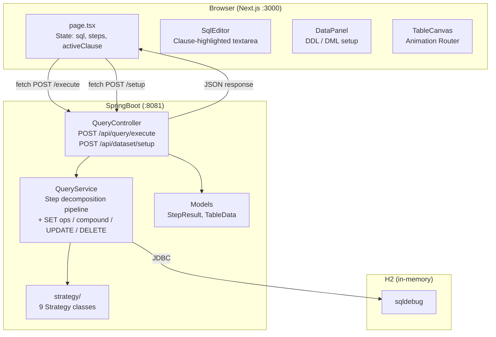
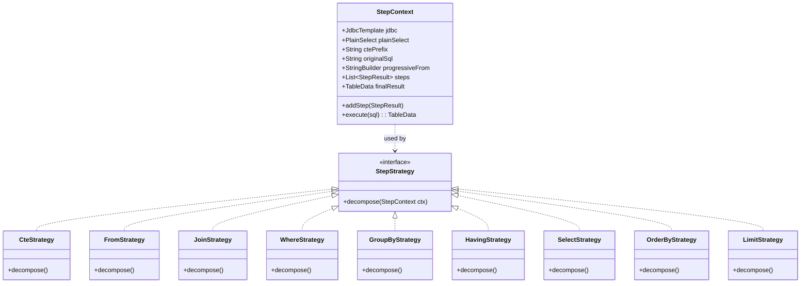
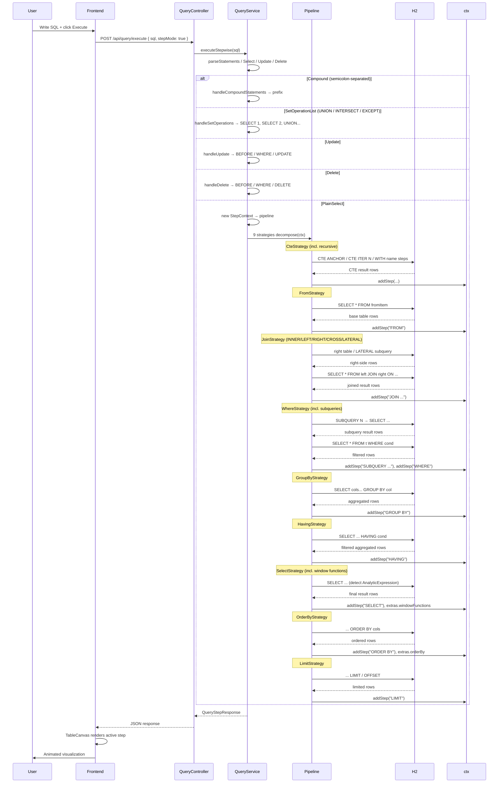

# Seeql — SQL Visual Debugger

Step-by-step SQL execution visualizer with animated clause-level transformations and an interactive logo that tracks your cursor.

Parses a SQL query, decomposes it into clause-level steps (FROM → WHERE → GROUP BY → HAVING → SELECT → DISTINCT → JOIN → ORDER BY → LIMIT), executes each against H2, and animates the transformations in the browser.

Supports CTEs (including recursive), subqueries in WHERE, set operations (UNION/INTERSECT/EXCEPT), multiple FROM items, LATERAL joins, window function annotations, compound statements, and UPDATE/DELETE decomposition.

---

## Architecture

### System Context



### Backend — Strategy Pattern



### Pipeline Execution



### Animation Dispatch Logic

```mermaid
flowchart LR
    A["Step from API"] --> B{"clause?"}
    B -->|"GROUP BY + has groupColumns"| GA["GroupAnimation<br/>5 phases"]
    B -->|"starts WITH " or "starts CTE "| CA["CteAnimation<br/>4 phases"]
    B -->|"DISTINCT"| DA["DistinctAnimation<br/>4 phases"]
    B -->|"includes JOIN "| JA["JoinAnimation<br/>4 phases"]
    B -->|"WHERE / HAVING / CTE.WHERE"| WA["WhereAnimation<br/>4 phases<br/>(pass/fail buckets)"]
    B -->|"SELECT / CTE.BODY"| SA["SelectAnimation<br/>4 phases<br/>(keep/drop column buckets)"]
    B -->|"ORDER BY"| OA["OrderByAnimation<br/>4 phases<br/>(staggered sort)"]
    B -->|"LIMIT"| LA["LimitAnimation<br/>4 phases<br/>(cutoff line)"]
    B -->|"else"| TA["TransitionAnimation<br/>3 phases<br/>(fallback for 10+ types)"]
```

### Frontend Component Tree

```mermaid
graph TB
    subgraph Layout["app/page.tsx"]
        PS["Problem Selector<br/>12 LeetCode problems"]
        SE["SqlEditor<br/>- Textarea<br/>- Clause-highlighting overlay"]
        DP["DataPanel<br/>- DDL tab<br/>- DML tab"]
        TC["TableCanvas<br/>- StepTimeline breadcrumb<br/>- Play/step controls<br/>- Speed slider (0.5-5x)"]
    end

    subgraph Animations["components/table-canvas/"]
        ST["StepTimeline<br/>Step progression bar"]
        GA["GroupAnimation<br/>5-phase bucket flying<br/>Rows → Assign → Buckets → Collapse → Result"]
        CA["CteAnimation<br/>4-phase partition<br/>Input → Partition → Compute → Result"]
        DA["DistinctAnimation<br/>4-phase dedup<br/>Rows → Mark → Remove → Result"]
        JA["JoinAnimation<br/>4-phase join<br/>Left → Right → Matching → Result<br/>(INNER/LEFT/RIGHT/CROSS/LATERAL)"]
        WA["WhereAnimation<br/>4-phase filter<br/>Evaluate → PASS/FAIL buckets → Result"]
        SA["SelectAnimation<br/>4-phase projection<br/>Columns → KEPT/DROPPED buckets → Result"]
        OA["OrderByAnimation<br/>4-phase sort<br/>Unsorted → Sorting → Sorted ranks → Result"]
        LA["LimitAnimation<br/>4-phase cutoff<br/>All → Cutoff → Remove → Result"]
        TA["TransitionAnimation<br/>3-phase generic<br/>Before → Appearing → Result"]
    end

    subgraph Shared["components/table-canvas/"]
        PB["PhaseBar<br/>Shared phase indicator<br/>(prev/play/next + pill segments + desc)"]
        SB["StepBadge<br/>Clause badge + SQL + row count"]
        RC["RowCard<br/>Animated row with variant left border<br/>pass/fail/kept/removed/moved/new/cut"]
        SBS["SideBySide<br/>Grid before/after table comparison<br/>+ VirtualTable for 100+ rows"]
        VT["VirtualTable<br/>@tanstack/react-virtual<br/>Scroll 500+ rows smoothly"]
    end

    subgraph Hooks["hooks/"]
        PS_HOOK["use-phase-stepper.ts<br/>prev/next/play/toggle<br/>respects speedMultiplier"]
        SP_HOOK["use-speed.tsx<br/>SpeedProvider context<br/>0.5x / 1x / 2x / 5x"]
    end

    subgraph Lib["lib/"]
        T["types.ts<br/>StepResult, TableData<br/>+ error / errorType fields"]
        A["api.ts<br/>fetch wrappers"]
        AU["animation-utils.ts<br/>staggerDelay, getAnimationType,<br/>getTransitionDescription"]
        CH["clause-highlighter.ts<br/>findClauses, findClauseSpans"]
    end

    TC --> ST
    TC -->|lazy next/dynamic| GA
    TC -->|lazy next/dynamic| CA
    TC -->|lazy next/dynamic| DA
    TC -->|lazy next/dynamic| JA
    TC -->|lazy next/dynamic| WA
    TC -->|lazy next/dynamic| SA
    TC -->|lazy next/dynamic| OA
    TC -->|lazy next/dynamic| LA
    TC -->|lazy next/dynamic| TA
    TC --> PB
    TC --> SB
    TC --> RC
    TC --> SBS
    GA --> PB
    GA --> RC
    GA --> PS_HOOK
    CA --> PB
    CA --> RC
    CA --> PS_HOOK
    DA --> PB
    DA --> RC
    DA --> PS_HOOK
    JA --> PB
    JA --> RC
    JA --> PS_HOOK
    WA --> PB
    WA --> RC
    WA --> PS_HOOK
    SA --> PB
    SA --> RC
    SA --> PS_HOOK
    OA --> PB
    OA --> RC
    OA --> PS_HOOK
    LA --> PB
    LA --> RC
    LA --> PS_HOOK
    TA --> PB
    TA --> RC
    TA --> PS_HOOK
    SBS --> VT
    SE --> CH
```



---

## Interactive Logo

The **Seeql** logo (top-left header) features a database cylinder with two eyes that:

- **Track your cursor** anywhere on the page (global mousemove listener)
- **Bug out + hide** when you hover over them (pupils dilate, eyes shake, shrink away)
- **Reappear** when you leave (smooth scale-in)

Built with Framer Motion `useMotionValue` + `useSpring` for smooth pupil tracking, and shared `type: "tween"` transitions on both sclera and pupil for perfectly synced show/hide animation.

---

## REST API

| Endpoint | Method | Body | Returns |
|----------|--------|------|---------|
| `/api/query/execute` | POST | `{ sql, stepMode }` | `{ steps: StepResult[], finalResult: TableData }` |
| `/api/dataset/setup` | POST | `{ sql }` | `{ status: "ok" }` |

### StepResult (SELECT query)

```json
{
  "clause": "JOIN busy b",
  "sql": "WITH busy AS (...) SELECT * FROM Stadium s JOIN busy b ON s.id = b.id",
  "data": { "columns": ["ID","PEOPLE","GRP"], "rows": [...], "totalRows": 6 },
  "groupColumns": ["GRP"],
  "error": null,
  "errorType": null,
  "extras": {
    "rightTableData": { "columns": [...], "rows": [...], "totalRows": 6 },
    "onCondition": "s.id = b.id",
    "rightTable": "busy b",
    "leftTable": "Stadium s",
    "joinType": "INNER"
  }
}
```

### StepResult (error)

```json
{
  "clause": "WHERE",
  "sql": "SELECT * FROM t WHERE invalid",
  "data": null,
  "error": "Column \"INVALID\" not found",
  "errorType": "SQL",
  "extras": {}
}
```

---

## Project Structure

```
Seeql/
├── Backend/sql-visualizer-backend/
│   ├── pom.xml
│   └── src/main/java/com/sqlvisualizer/backend/
│       ├── SqlVisualizerBackendApplication.java
│       ├── config/CorsConfig.java
│       ├── controller/QueryController.java
│       ├── model/
│       │   ├── QueryRequest.java
│       │   ├── TableData.java
│       │   └── QueryStepResponse.java       # + error / errorType fields
│       ├── service/
│       │   └── QueryService.java             # pipeline + SET/compound/UPDATE/DELETE
│       └── strategy/
│           ├── StepStrategy.java
│           ├── StepContext.java
│           ├── CteStrategy.java
│           ├── FromStrategy.java
│           ├── JoinStrategy.java
│           ├── WhereStrategy.java
│           ├── GroupByStrategy.java
│           ├── HavingStrategy.java
│           ├── SelectStrategy.java
│           ├── OrderByStrategy.java
│           └── LimitStrategy.java
│
├── Frontend/fitkit-web/
│   ├── app/
│   │   ├── layout.tsx                       # title: "Seeql — SQL Visual Debugger"
│   │   ├── page.tsx                         # SeeqlWordmark in header
│   │   ├── icon.svg                         # animated SVG favicon
│   │   └── globals.css
│   ├── components/
│   │   ├── seeql-logo.tsx                   # eye-tracking SVG logo
│   │   ├── sql-editor/SqlEditor.tsx
│   │   ├── data-panel/DataPanel.tsx
│   │   ├── table-canvas/
│   │   │   ├── TableCanvas.tsx              # lazy-loaded animation router + speed slider
│   │   │   ├── StepTimeline.tsx
│   │   │   ├── PhaseBar.tsx                 # shared phase indicator
│   │   │   ├── StepBadge.tsx                # shared clause badge
│   │   │   ├── RowCard.tsx                  # shared animated row
│   │   │   ├── SideBySide.tsx               # shared before/after comparison + VirtualTable
│   │   │   ├── VirtualTable.tsx             # @tanstack/react-virtual integration
│   │   │   ├── GroupAnimation.tsx           # 5-phase GROUP BY
│   │   │   ├── CteAnimation.tsx             # 4-phase WITH / window
│   │   │   ├── DistinctAnimation.tsx        # 4-phase DISTINCT
│   │   │   ├── JoinAnimation.tsx            # 4-phase JOIN
│   │   │   ├── WhereAnimation.tsx           # 4-phase WHERE/HAVING
│   │   │   ├── SelectAnimation.tsx          # 4-phase SELECT projection
│   │   │   ├── OrderByAnimation.tsx         # 4-phase ORDER BY sort
│   │   │   ├── LimitAnimation.tsx           # 4-phase LIMIT cutoff
│   │   │   └── TransitionAnimation.tsx      # 3-phase fallback
│   │   └── ui/                              # shadcn components
│   ├── hooks/
│   │   ├── use-phase-stepper.ts             # respects speedMultiplier from context
│   │   ├── use-speed.tsx                    # SpeedProvider context (0.5-5x)
│   │   └── use-theme.ts
│   ├── lib/
│   │   ├── api.ts
│   │   ├── types.ts                         # StepResult.error / errorType
│   │   ├── animation-utils.ts               # staggerDelay, getAnimationType, etc.
│   │   ├── clause-highlighter.ts
│   │   ├── problems.ts
│   │   └── utils.ts
│   └── public/workers/
│       └── row-diff-worker.js               # off-thread row comparison
│
└── README.md
```

---

## Stack

| Layer | Technology |
|-------|-----------|
| Frontend | Next.js 16, TypeScript, Framer Motion, shadcn/Radix UI, @tanstack/react-virtual |
| Backend | SpringBoot 4.0.6, Java 21, JSQLParser 5.3 |
| Database | H2 (in-memory, port 8081) |

---

## Key Design Decisions

- **Single request/response**: Backend returns ALL step results in one response. Frontend owns animation timing and pacing.
- **Strategy pattern**: Each SQL clause is a separate strategy class implementing `StepStrategy`.
- **Progressive JOIN building**: The Nth JOIN step includes all N joins in its FROM clause.
- **Implicit comma joins**: Parsed as `isSimple()` cross joins. JoinStrategy appends `, rightItem`.
- **LATERAL joins**: Detected via `instanceof LateralSubSelect`. Inner subquery extracted and executed independently.
- **Subqueries in WHERE**: `ParenthesedSelect` nodes detected via `ExpressionVisitorAdapter` overriding `visit(Select)`.
- **Recursive CTE**: Decomposed into `CTE ANCHOR` / `CTE ITER N` / final `WITH name` steps.
- **Window functions**: `AnalyticExpression` detected in SELECT items; metadata added to step extras.
- **UPDATE/DELETE**: `BEFORE` → `WHERE` → `UPDATE`/`DELETE` with `beforeData` and `setAssignments`.
- **Compound statements**: Auto-split via `CCJSqlParserUtil.parseStatements()`. Step clauses prefixed with `#1`, `#2`.
- **Set operations**: Each `SELECT` executed independently, combined in final step.
- **Shared animation primitives**: `PhaseBar`, `StepBadge`, `RowCard`, `SideBySide` used across all 9 animation components for consistent look and behavior.
- **Lazy-loaded animations**: All 9 animation components loaded via `next/dynamic` with `ssr: false`.
- **Virtual scrolling**: `VirtualTable` component uses `@tanstack/react-virtual` to smoothly render 500+ row datasets.
- **Speed context**: `SpeedProvider` wraps the app root; a 0.5×–5× slider in `TableCanvas` controls animation pacing globally without touching any animation file.
- **Error fields**: `StepResult.error` / `errorType` on both backend and frontend for differentiated error display.
- **Eye-tracking logo**: Global `mousemove` listener drives `useMotionValue` / `useSpring` pupils that follow the cursor; `scaredRef` freezes tracking during the bug-out hide animation.

---

## Running Locally

### Backend

```bash
cd Backend/sql-visualizer-backend
mvn spring-boot:run
# Starts on :8081 with H2 in-memory DB
```

### Frontend

```bash
cd Frontend/fitkit-web
npm install
npm run dev
# Opens on :3000
```

Open `http://localhost:3000` — the app auto-loads the first LeetCode problem. Select a problem from the dropdown or write your own SQL and click Execute.
