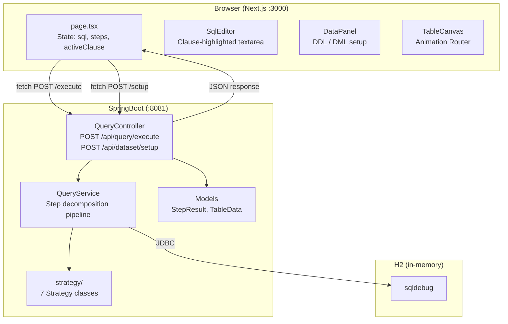
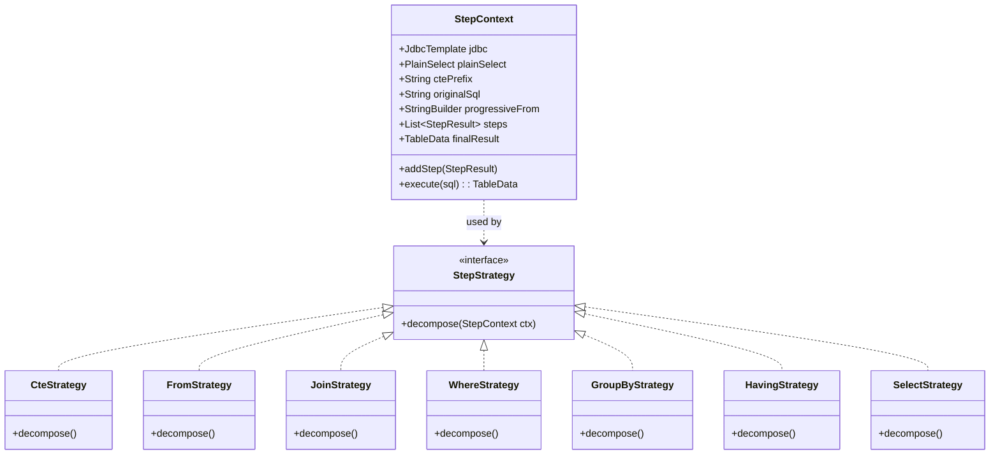
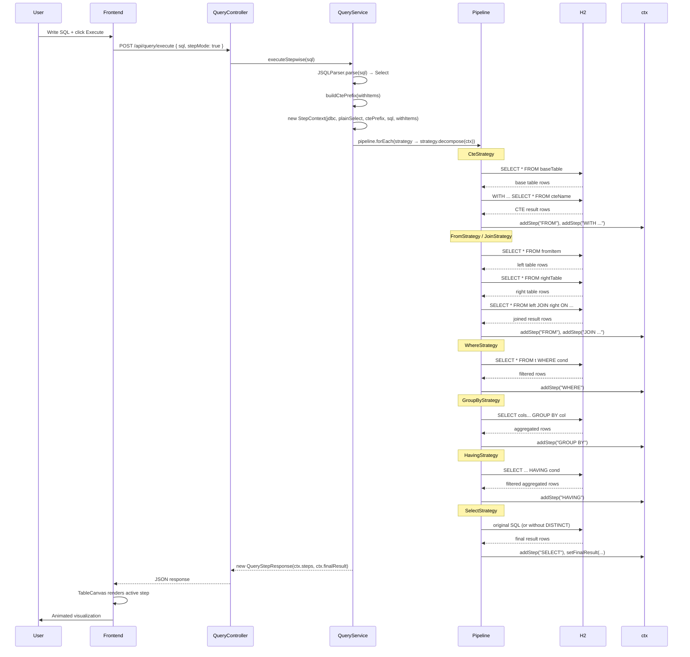
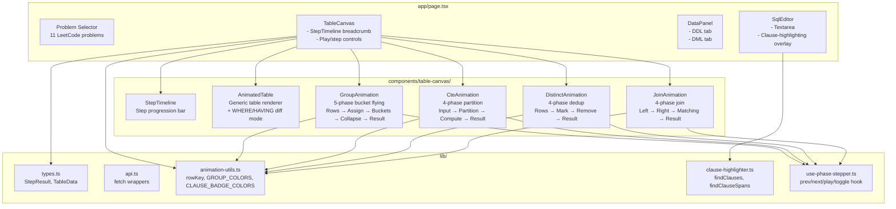
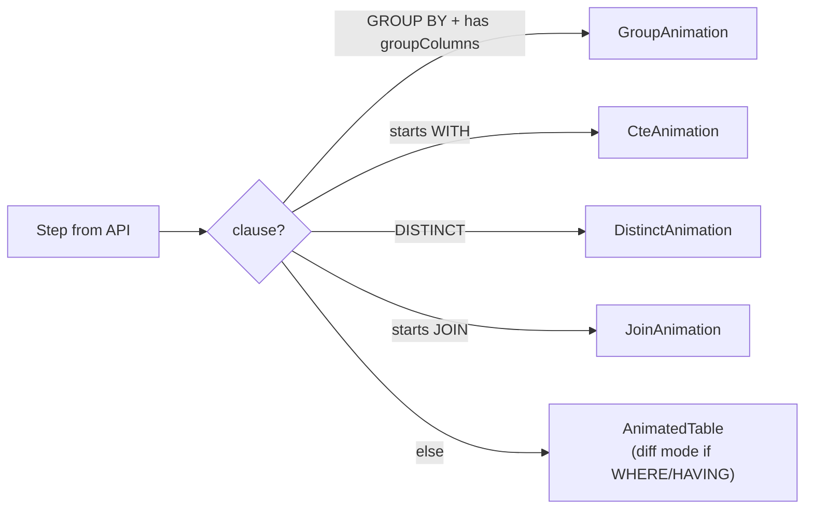

# Seeql — SQL Visual Debugger

Step-by-step SQL execution visualizer. Parses a SQL query, decomposes it into clause-level steps (FROM → WHERE → GROUP BY → HAVING → SELECT → DISTINCT → JOIN), executes each against H2, and animates the transformations in the browser.

---

## Architecture

### System Context



### Backend — Strategy Pattern



### Pipeline Execution



### Frontend Component Tree



### Animation Dispatch Logic



---

## REST API

| Endpoint | Method | Body | Returns |
|----------|--------|------|---------|
| `/api/query/execute` | POST | `{ sql, stepMode }` | `{ steps: StepResult[], finalResult: TableData }` |
| `/api/dataset/setup` | POST | `{ sql }` | `{ status: "ok" }` |

### StepResult

```json
{
  "clause": "JOIN busy b",
  "sql": "WITH busy AS (...) SELECT * FROM Stadium s JOIN busy b ON s.id = b.id",
  "data": { "columns": ["ID","PEOPLE","GRP"], "rows": [...], "totalRows": 6 },
  "groupColumns": ["GRP"],
  "extras": {
    "rightTableData": { "columns": [...], "rows": [...], "totalRows": 6 },
    "onCondition": "s.id = b.id",
    "rightTable": "busy b",
    "leftTable": "Stadium s",
    "joinType": "INNER"
  }
}
```

---

## Project Structure

```
Seeql/
├── Backend/sql-visualizer-backend/
│   ├── pom.xml
│   └── src/main/java/com/sqlvisualizer/backend/
│       ├── SqlVisualizerBackendApplication.java
│       ├── config/CorsConfig.java
│       ├── controller/QueryController.java
│       ├── model/
│       │   ├── QueryRequest.java
│       │   ├── TableData.java
│       │   └── QueryStepResponse.java
│       ├── service/
│       │   └── QueryService.java
│       └── strategy/
│           ├── StepStrategy.java          # interface
│           ├── StepContext.java           # shared context
│           ├── CteStrategy.java
│           ├── FromStrategy.java
│           ├── JoinStrategy.java
│           ├── WhereStrategy.java
│           ├── GroupByStrategy.java
│           ├── HavingStrategy.java
│           └── SelectStrategy.java
│
├── Frontend/fitkit-web/
│   ├── app/
│   │   ├── layout.tsx
│   │   └── page.tsx
│   ├── components/
│   │   ├── sql-editor/SqlEditor.tsx
│   │   ├── data-panel/DataPanel.tsx
│   │   ├── table-canvas/
│   │   │   ├── TableCanvas.tsx           # animation router
│   │   │   ├── StepTimeline.tsx
│   │   │   ├── AnimatedTable.tsx
│   │   │   ├── GroupAnimation.tsx        # 5-phase
│   │   │   ├── CteAnimation.tsx          # 4-phase
│   │   │   ├── DistinctAnimation.tsx     # 4-phase
│   │   │   └── JoinAnimation.tsx         # 4-phase
│   │   └── ui/                           # shadcn components
│   ├── hooks/
│   │   └── use-phase-stepper.ts
│   └── lib/
│       ├── api.ts
│       ├── types.ts
│       ├── animation-utils.ts
│       ├── clause-highlighter.ts
│       ├── problems.ts                   # 12 LeetCode problems
│       └── utils.ts
│
└── README.md
```

---

## Stack

| Layer | Technology |
|-------|-----------|
| Frontend | Next.js 16, TypeScript, Framer Motion, shadcn/Radix UI |
| Backend | SpringBoot 4.0.6, Java 21, JSQLParser 5.3 |
| Database | H2 (in-memory, port 8081) |

---

## Key Design Decisions

- **Single request/response**: Backend returns ALL step results in one response. Frontend owns animation timing and pacing.
- **Strategy pattern**: Each SQL clause (FROM, WHERE, GROUP BY, HAVING, SELECT, JOIN, CTE) is a separate strategy class implementing `StepStrategy`. Adding a new clause type = adding one new class → no existing code changes.
- **Progressive JOIN building**: The Nth JOIN step includes all N joins in its FROM clause, so CTE + multi-JOIN queries work correctly.
- **CTE-body exclusion**: Clause-highlighter skips standard SQL keywords inside CTE body parentheses — only main-query clauses are highlighted.
- **Shared animation primitives**: `rowKey`, `GROUP_COLORS`, `CLAUSE_BADGE_COLORS`, `getGroupColor`, `isGroupStep` are shared across all animation components.
- **usePhaseStepper**: Custom hook provides prev/next/play/toggle with inline phaseIdx clamp (no crashes when phases array length changes).
